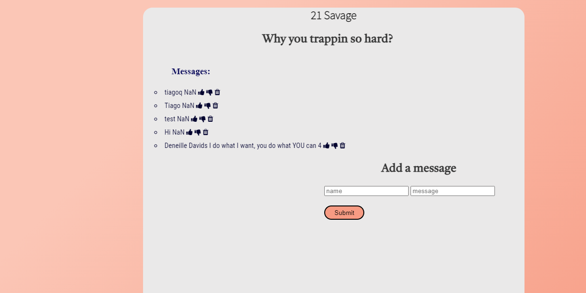

# My Savage Auth Project
This project shows an interactive application used to enjoy popular lyrics from the famous 21 Savage. Other fans are able to like delete and unlike their messages as they please. 

## How It's Made:

**Tech used:** HTML, CSS, JavaScript, Node.js, MongoDb

I utilized my skills in javaScript, HTML and CSS to capture an inviting application for users. I also utilized Mongo.Db and Node.js to serve up information to a user after they send a request to my server. I am able to view and manipulate(delete) users information as they provide it.

## Lessons Learned:
I learned to use a prole.ejs file to create a user login page for users to target their personal 21 fan site as well as contribute to the comments and contribtions of others.